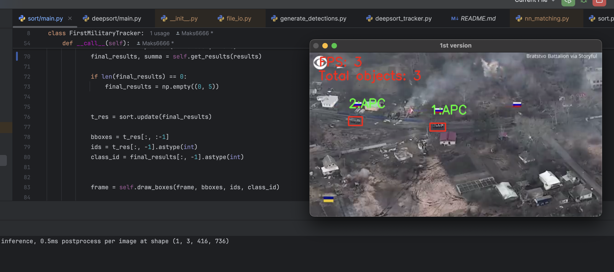
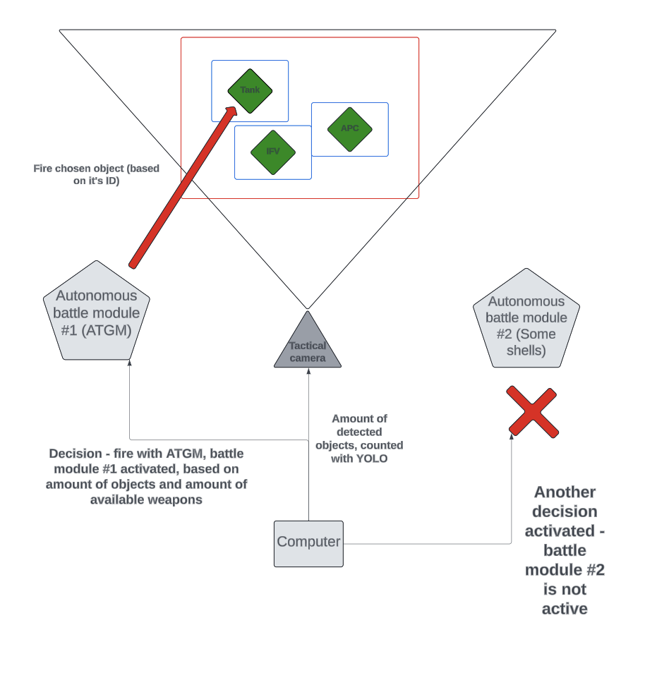
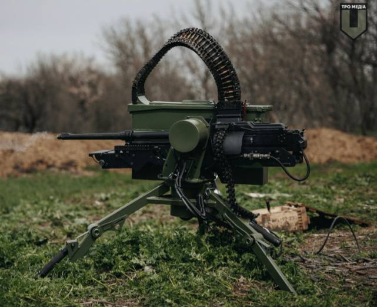
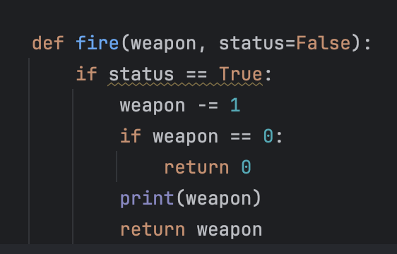
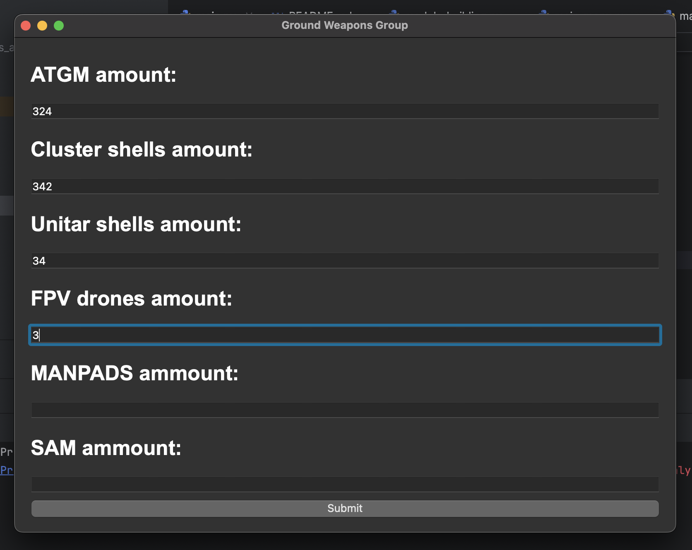
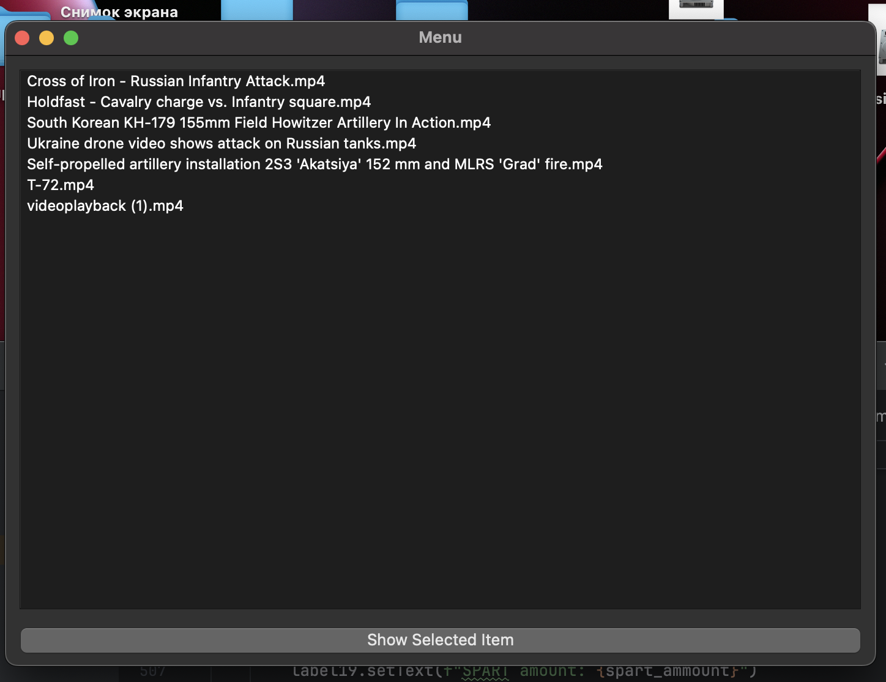
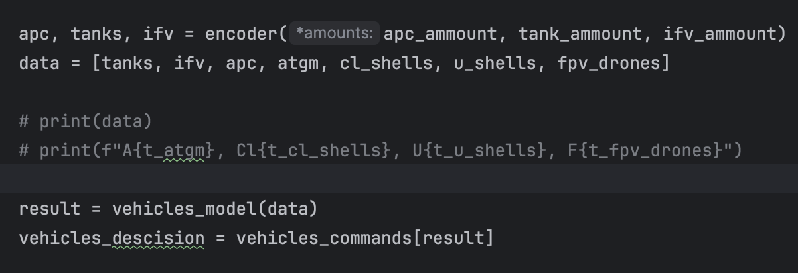
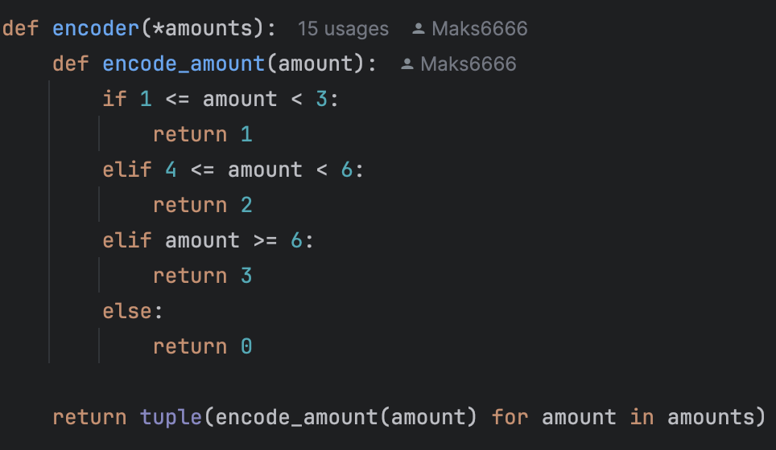
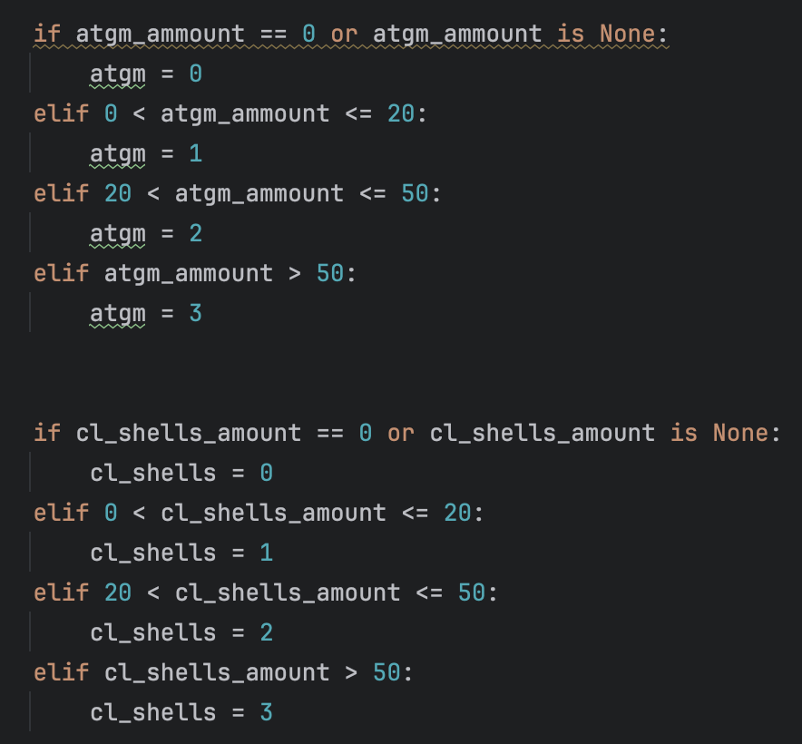

# Tactic battle control system based on AI technology (YOLOv9/custom models).


## Idea

Combat operations are typically divided into three main levels: tactical, operational and strategic. Success in each of them guarantees victory in the war, but in all wars, there is one common problem that inevitably befalls any of the parties to the conflict after prolonged hostilities. A shortage of personnel in the first place can have a very serious impact on the situation on the front line - at first, the shortage of soldiers will affect the tactical level of combat operations, which will almost inevitably lead to a crisis at higher levels. This is especially true for the side that is on the defensive.

This problem of personnel shortages can be partially solved with the help of autonomous combat modules - robotic machine guns, anti-tank systems, anti-aircraft machine guns, etc. however, they also need to be monitored, which also requires a considerable number of people. However, this problem can be addressed using simple AI algorithms: multi-level convolutional networks for detecting objects like YOLO for tracking the situation on the battlefield and simple ANN for analyzing the information received and making certain decisions that will be transferred to automatic combat modules.



The idea behind the solution is that a high-resolution tactical camera is placed on the battlefield with access to a processor to run the program. The camera tracks enemy activity: using the YOLOv9c model, which is trained on a custom dataset (https://www.kaggle.com/datasets/nzigulic/military-equipment/code), as well as the YOLOv9c model with default settings, the program tracks five groups of potential enemies: attacking armored vehicles (tanks, APCs, IFV), special equipment (engineering vehicles, air defense systems), human infantry, artillery (self-propelled guns and towed artillery) and aviation (combat aircraft, transport aircraft, combat helicopters, transport helicopters).

Next, the defense sector commander enters in a special field the amount of ammunition available for use for immediate defense - (ATGMs, cluster and unitary munitions, FPV kamikaze drones, anti-aircraft missiles and MANPADS) - this part can also be optimized using sensors that will directly read the amount of ammunition.

The camera is placed in such a way that the area where enemy activity is expected is visible - one of the program options offers integration of the camera with a Tello model drone for greater convenience, but a regular high-resolution camera will also work. The camera must be connected to a laptop computer, which will perform the main calculations.



*Automatic combat module "Shablya" of the Armed Forces of Ukraine. This program could group, coordinate and systematize the central control of combat systems of this category.*

The program involves a combination with autonomous combat modules (automatic machine guns, ATGM positions and FPV drones, etc., which will operate autonomously or with minimal human intervention). This means that using the camera and YOLO models, the program will calculate the number of objects of one type or another in the video, combine this with the number of available weapons, feed the obtained data into one of the custom analyzer models written in PyTorch, which will return a specific solution, which will have to activate one or another combat module, direct it to the desired object (at the moment, priority is given to the object with the lowest ID, that is, the one that was detected first, however it could be changed by integration of another logic) 
and will force him to produce a target according to the coordinates of the object. The shot will automatically reduce the amount of ammunition that was used - for now, the amount is reduced automatically, two seconds after detection and targeting of the desired object, however in the future, this could be integrated directly with automatic combat modules - for now, the program is more the “brain” of such a small tactical battle control system, which is capable of making simple decisions based on visually obtained data.



*This function implements the logic: after selecting a weapon of a suitable category, 1 will be subtracted from the number of the selected type of weapon every 2 seconds, simulating the waste of ammunition per shot. Unfortunately, I have not yet had time to study in detail the issue of integrating the “brain” with autonomous combat systems, but I assume that this should be implemented in this function.*


## Programm


*Here user may fit an amount of available weapons.*



*Here user may choose a video file or camera it wants to use.*

When launching the program, the user has the opportunity to choose a method for reading information: a camera to which the device has access or a video file, which must (!) be located in the same directory as the project, in a folder called “videos”. The user then manually enters the number of available weapons - the part that could later be automated using sensors and which feeds the model with data on the number of weapons.


Then, using OpenCV algorithms, the program opens the selected file and passes each frame through two YOLO models - the first of them, trained on custom data, is necessary for detecting military equipment. The second is a model with default settings, which is adapted for detecting people - enemy infantry.



*The logic for encoding the number of available weapons and feeding data about them and the number of detected equipment into the model is displayed here.*



*The logic for encoding detected objects is indicated here.*



*Logic for encoding the number of available weapons.*


During the program execution, the bounding boxes for the detected objects (in the diagram above, they are marked in blue and the activity zone of a particular type of military equipment, in the diagram above, they are marked in red) and their total number are displayed on the screen. The program also counts the number of objects of each type and, together with the number of weapons, encodes values of them and transmits them to each of the five custom neural network models to decide which weapon should be used in a specific situation - that is, to which of the autonomous combat modules the attack signal should be transmitted. Each of the models returns a decision index, which is passed to the list and displayed as text on one of the visual screens, as shown in the title image - in the "decision" stanza. The visual interface also displays the number of objects of each class and provides a short reference on the current situation on the battlefield: which object is under attack by what weapon, what time it was discovered, etc. All this is implemented using the PyQT visual interface library.

IMPORTANT: since my operating system does not allow handling multi-threaded processes with a visual interface, to execute the main loop - the "Main" function in the file of the same name, which implements drawing of bounding boxes, deployment of models, decision making, etc., I had to use QtTimer from the PyQT library: 

```
timer = QtCore.QTimer()
timer.timeout.connect(main)
timer.start(1)
```

Thus, first, after working with the initial menu, the code will call functions to create windows and every millisecond the "Main" function will be updated. After each such cycle, the windows with information will be updated. The pause is completely unnoticeable for the user, but it helps to prevent an error with threads.

## Project structure


The main project consists of the following number of files:

· "Main" file - file with the main script for activating YOLO models and deploying analyzer models. It implements the call of the main functions.

· "Functions" file - this file implements the main part of the project's functions, which are later imported into "Main": encoding, drawing bounding boxes and creating data frames for each group of detected objects, which is used in the indexing and targeting system (see below).

· "Main menu" - here the interface of the initial menu is implemented, where the user can select a video file or connect to an available camera and enter the number of available weapons. These functions are also transferred to the "main".

· "Interface" file - the main number of scripts for creating and configuring PyQT visual interface are implemented here - primarily information screens, where data on detected objects and decisions made are displayed.

· "Custom models building" - here I implement the construction and training of custom PyTorch models on custom data (which is already presented in encoded format) for analyzing information from the battlefield. After training the models, their weights are saved for further use.

· "Models building" - here the obtained weights are attached to models with disabled gradients. Also implemented are functions that will accept data arrays - encoded number of objects and ammunition, pass them to the model and return the result. These functions are imported in the "main".

· "Main v01" - the initial version of the project, where the interface is implemented using OpenCV.

· "Main tello" - version of the project for combination with Tello drones.

. 'videos' - folder with videos that the user can select at the beginning of the program. Remember that when you launch your project and upload your video files, you need a folder with EXACTLY the same name ('videos') in the directory of your project.

. "Custom models" - weights of custom trained models.

. "YOLO" - YOLO model, trained on custom data.


## Targeting and etc...
    
To be continued...

## Authors:
- Kucher Maks (maxim.kucher2005@gmail.com)
