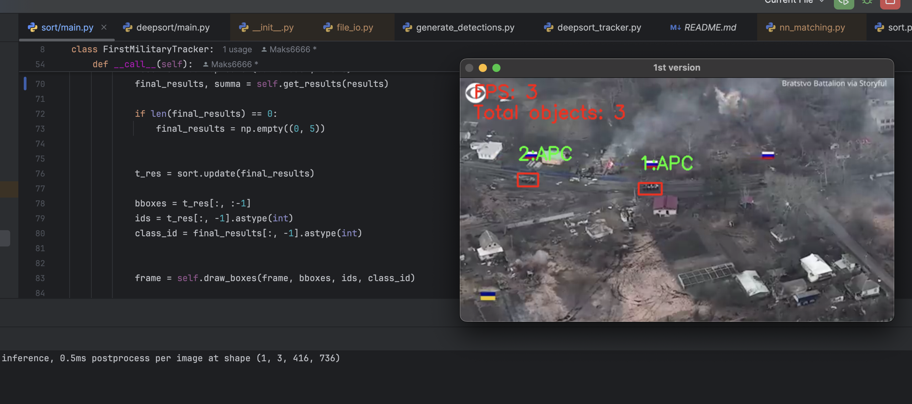
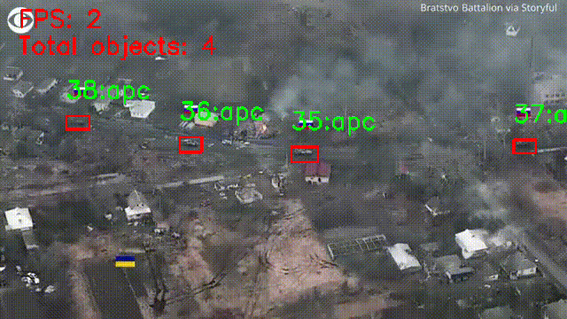

# (BCS) Update 2:

1) I decided to apply a new approach of detection. In previous versions, I used YOLO-model trained on custom data to
detect 10 or 3 classes of military vehicles. Second version works much better and return high accuracy score, but to increase it,
i decided to make YOLO-model find only one class: "vehicle", which includes photos of tanks, APC's and IFV's. I'm planning to 
combine it with custom classification model to split tasks among two different models. In classificator model I will combine
different accuracy improving methods such as transfer learning, knowledge distillation and specific architecture approach - 
combination of skip-connection, dense-net and usual convolutional network methods.

Results: according to results, I must admit, that accuracy of object detection increased for a little bit 
with using two separate models, but the same time accuracy of classification was reduced and custom model makes some mistakes.

Model detects APS's, but classifies it wrong:

Once again model detects APC pretty well despite low quality of video, but it classifies it wrong:

Here model classifies them better, but it remains unstable:

It's quite obvious that the problem is in classification model, so I'm going ot try implement it in the most accurate form.
To be continued... 
