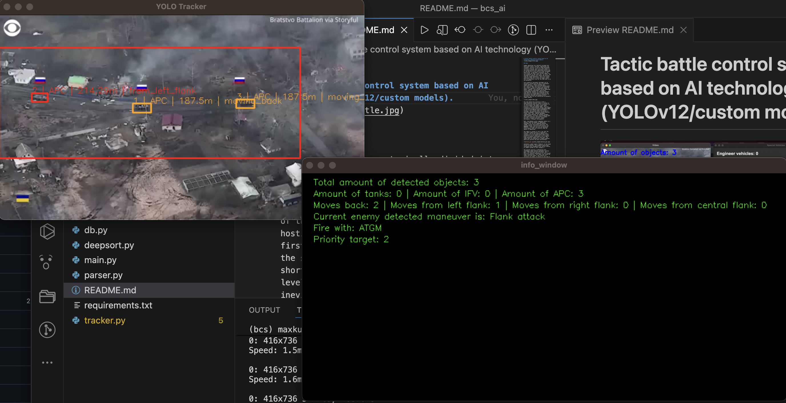
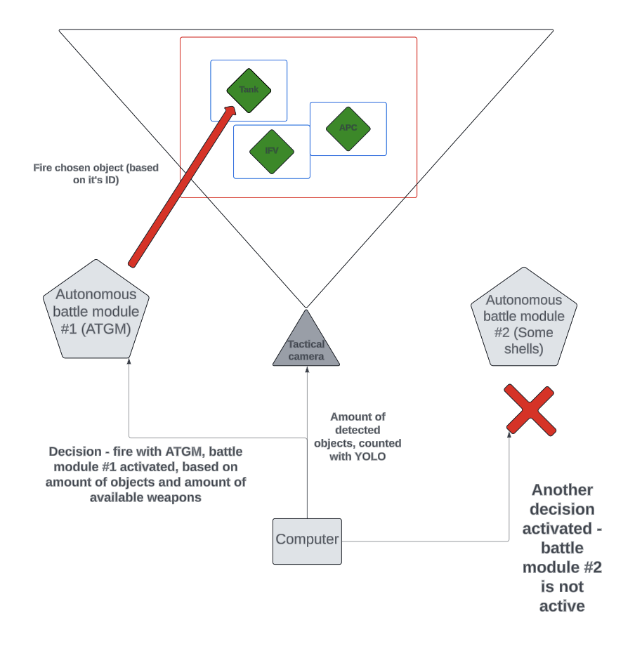
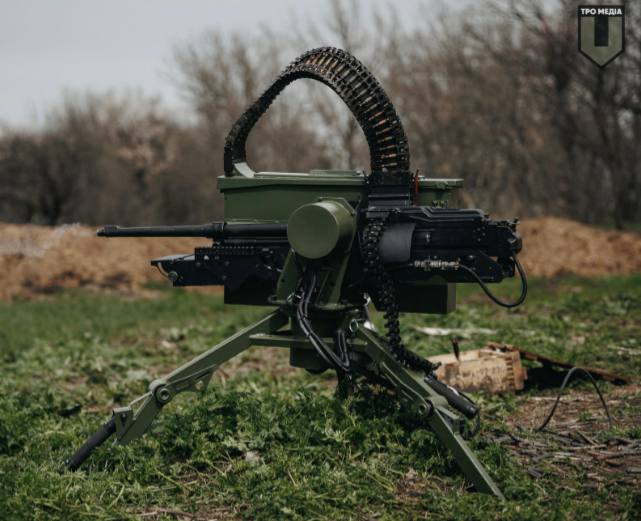
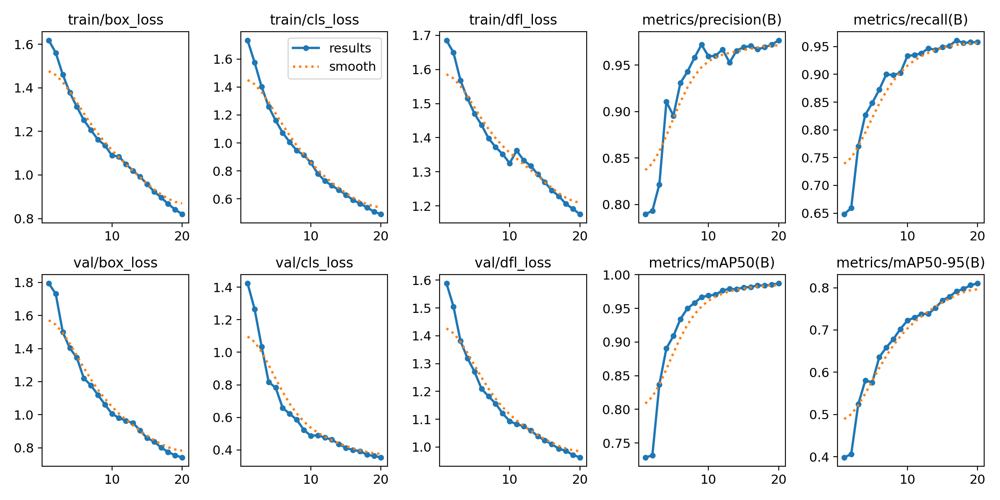
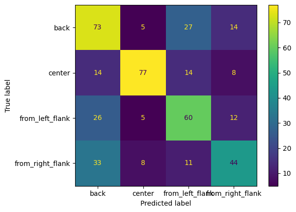

# Tactic battle control system based on AI technology (YOLOv12/custom models). 


## Idea

Combat operations are typically divided into three main levels: tactical, operational and strategic. Success in each of them guarantees victory in the war, but in all wars, there is one common problem that inevitably befalls any of the parties to the conflict after prolonged hostilities. A shortage of personnel in the first place can have a very serious impact on the situation on the front line - at first, the shortage of soldiers will affect the tactical level of combat operations, which will almost inevitably lead to a crisis at higher levels. This is especially true for the side that is on the defensive.

This problem of personnel shortages can be partially solved with the help of autonomous combat modules - robotic machine guns, anti-tank systems, anti-aircraft machine guns, etc. however, they also need to be monitored, which also requires a considerable number of people. However, this problem can be addressed using simple AI algorithms: multi-level convolutional networks for detecting objects like YOLO for tracking the situation on the battlefield and simple ANN for analyzing the information received and making certain decisions that will be transferred to automatic combat modules.



The idea behind the solution is that a high-resolution tactical camera is placed on the battlefield with access to a processor to run the program. The camera tracks enemy activity: using the YOLOv12т model, which is trained on a custom dataset (https://www.kaggle.com/datasets/nzigulic/military-equipment/code), as well as the YOLOv12n model with default settings, the program tracks five groups of potential enemies: attacking armored vehicles tanks, APCs, IFV and etc.

Next, the defense sector commander enters in a special field the amount of ammunition available for use for immediate defense - (ATGMs, cluster and unitary munitions, FPV kamikaze drones) - this part can also be optimized using sensors that will directly read the amount of ammunition.

The camera is placed in such a way that the area where enemy activity is expected is visible - one of the program options offers integration of the camera with a Tello model drone for greater convenience, but a regular high-resolution camera will also work. The camera must be connected to a laptop computer, which will perform the main calculations.



*Automatic combat module "Shablya" of the Armed Forces of Ukraine. This program could group, coordinate and systematize the central control of combat systems of this category.*

The program involves a combination with autonomous combat modules (automatic machine guns, ATGM positions and FPV drones, etc., which will operate autonomously or with minimal human intervention). This means that using the camera and YOLO models, the program will calculate the number of objects of one type or another in the video, combine this with the number of available weapons, feed the obtained data into one of the custom analyzer models written in PyTorch, which will return a specific solution, which will have to activate one or another combat module, direct it to the desired object (at the moment, priority is given to the object with the lowest ID, that is, the one that was detected first, however it could be changed by integration of another logic) 
and will force him to produce a target according to the coordinates of the object. The shot will automatically reduce the amount of ammunition that was used - for now, the amount is reduced automatically, two seconds after detection and targeting of the desired object, however in the future, this could be integrated directly with automatic combat modules - for now, the program is more the “brain” of such a small tactical battle control system, which is capable of making simple decisions based on visually obtained data.

! So basically, this project could be considered as a 'brain' for autonomous battle module, which is able to find targets on a video, classifiy and count them, define their movement vectors, find a top priority target and suggest an autonomous module with a best 
tactical decision - what weapon to use in each specific situation. 


## Main details

1. When launching the program, the user has the opportunity to choose a videofile, on which all 
all manipulation and detection will be displayed.

2. Then, using OpenCV algorithms, the program opens the selected file and passes each frame through YOLO model, trained on custom data, is for detecting military equipment. Thus it draws 
a bounding box around each detected object. 
*This is result of YOLO model training*

3. Next, using DeepSort algorithm, system assigns persistent IDs to detected objects.

4. Movement pattern prediction: Cropped frame sequences are collected for each tracked object (in total 16 frames per iteration), then program computes вense optical flow between consecutive frames to estimate pixel-level motion. The average motion vectors (dx, dy) and their magnitude are aggregated into a tensor that represents the temporal movement pattern of the tracked object. Simply put, it converts the pixel motion pattern into a tensor, which passed to trained LSTM (long-short term memory)
neural network, which is able to analyse and memorize this pattern of pixel movement and classify direction of it. Thus happens classification of movement vector of vehicles. 
*This is result of LSTM model training, which is really not bad*


5. The system is also able to assing a priority
level as a target to each detected object taking into accout such factors as object distance from camera (calculated with Focal length formula), it's type (f.e. tanks have higher priority then APC's have) and etc. Summarazing this factors system predictes the top priority target to be fired with suggested weapon.

6. Best weapon suggestion: A command model (decision tree classifier) summarize all of above mentioned factors - amount of remained weapons, type of targets and etc. and suggest a potential commander with the best tactical decision in current situation. 

## Requirements

Install Python dependencies before running the project.

The project requires the following Python packages:

- `ultralytics>=8.0.100`
- `torch>=2.0.0`
- `opencv-python>=4.7.0`
- `deep-sort-realtime>=1.3.2`
- `numpy>=1.23.0`
- `SQLAlchemy==2.0.23`
- `scikit-learn>=1.6.0`
- `psycopg2-binary==2.9.9`
- `filterpy==1.4.5`

You can install them manually with:

```bash
pip install ultralytics>=8.0.100 torch>=2.0.0 opencv-python>=4.7.0 \
deep-sort-realtime>=1.3.2 numpy>=1.23.0 SQLAlchemy==2.0.23 \
scikit-learn>=1.6.0 psycopg2-binary==2.9.9 filterpy==1.4.5
```

Alternatively, if the project includes a `requirements.txt` file, install all dependencies with:

```bash
pip install -r requirements.txt
```

## How to run?

To launch the tracker:

```bash
python3 main.py \
--path ./video/test_video_1.mp4 \
--atgm 30 \
--cl_shells 30 \
--un_shells 30 \
--fpv 30
```
## Arguments

The application accepts the following command-line arguments:

- `--path` — path to the input video
- `--atgm` — number of available ATGM rounds
- `--cl_shells` — number of available cluster shells
- `--un_shells` — number of available unitary shells
- `--fpv` — number of available FPV drones


## Project structure

```text
.
├── tracker.py
├── main.py
├── parser.py
├── conv_lstm_model.py
├── db.py
├── yolo/
│   └── main_weight.pt
├── decision_model/
│   └── tactic_model.py
├── weapon_model/
│   └── weapon_model.py
├── src/
│   ├── threat.py
│   ├── distance.py
│   ├── vehicles_counter.py
│   ├── status_counter.py
│   ├── items_encoder.py
│   ├── tactic_predictor.py
│   ├── weapon_counter.py
│   └── command_predictor.py
└── video/
    └── test_video_1.mp4
```
## Output

During execution, the system opens two OpenCV windows.

### YOLO Tracker

Displays:
- bounding boxes
- tracked object IDs
- vehicle class
- estimated distance
- predicted action
- priority target marker

### Info Window

Displays:
- total number of detected objects
- number of tanks, IFVs, and APCs
- distribution of actions
- predicted enemy maneuver
- recommended weapon
- current priority target

## Logged data

The system stores detected objects and their actions in the database.

Each entry may include:
- object ID
- vehicle type
- predicted action

## Example workflow

1. Load the input video.
2. Detect and track vehicles frame by frame.
3. Estimate distance and threat level.
4. Predict tactical movement using temporal motion features.
5. Recommend a weapon based on the battlefield composition.
6. Highlight the highest-priority target.
7. Save data to the database.

## Notes

The model weights must be available at:

```
./yolo/main_weight.pt
```

The test video path in the example is:

```
./video/test_video_1.mp4
```

The project automatically selects the best available device:

- `mps`
- `cuda`
- `cpu`

## Limitations

- the system currently supports only predefined vehicle classes
- movement classification depends on short temporal windows
- distance estimation is based on approximate real vehicle widths


Thanks for your attantion:)

The project may be supplemented in the future.

## Authors:
Kucher Maks (maxim.kucher2005@gmail.com / Telegramm (for contacts): @aeternummm)

## Addition: 
Project also has a web part, which makes testing and usage for average users much more easy. It is available via link: 

https://github.com/huziichuk/bcs-web

Web author: Nazar Huziichuk

